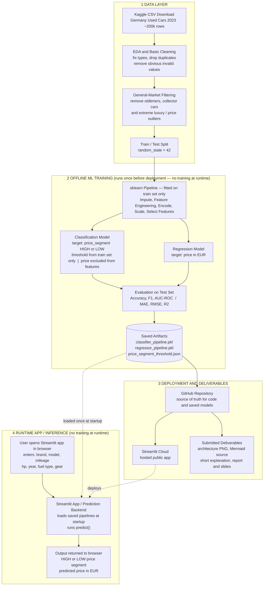

```mermaid
flowchart TB

    subgraph DATA["1  DATA LAYER"]
        CSV["Kaggle CSV Download\nGermany Used Cars 2023  ~200k rows"]
        EDA["EDA and Basic Cleaning\nfix types, drop duplicates\nremove obvious invalid values"]
        FILTER["General-Market Filtering\nremove oldtimers, collector cars\nand extreme luxury / price outliers"]
        SPLIT["Train / Test Split\nrandom_state = 42"]
        CSV --> EDA --> FILTER --> SPLIT
    end

    subgraph OFFLINE["2  OFFLINE ML TRAINING  (runs once before deployment — no training at runtime)"]
        PIPE["sklearn Pipeline — fitted on train set only\nImpute, Feature Engineering, Encode, Scale, Select Features"]
        CLS["Classification Model\ntarget: price_segment  HIGH or LOW\nthreshold from train set only  |  price excluded from features"]
        REG["Regression Model\ntarget: price in EUR"]
        EVAL["Evaluation on Test Set\nAccuracy, F1, AUC-ROC  /  MAE, RMSE, R2"]
        ARTS[("Saved Artifacts\nclassifier_pipeline.pkl\nregressor_pipeline.pkl\nprice_segment_threshold.json")]
        PIPE --> CLS
        PIPE --> REG
        CLS --> EVAL
        REG --> EVAL
        EVAL --> ARTS
    end

    subgraph DEPLOY["3  DEPLOYMENT AND DELIVERABLES"]
        GH["GitHub Repository\nsource of truth for code and saved models"]
        SC["Streamlit Cloud\nhosted public app"]
        DL["Submitted Deliverables\narchitecture PNG, Mermaid source\nshort explanation, report and slides"]
        GH --> SC
        GH --> DL
    end

    subgraph RUNTIME["4  RUNTIME APP / INFERENCE  (no training at runtime)"]
        USER["User opens Streamlit app in browser\nenters: brand, model, mileage\nhp, year, fuel type, gear"]
        APP["Streamlit App / Prediction Backend\nloads saved pipelines at startup\nruns predict()"]
        OUT["Output returned to browser\nHIGH or LOW price segment\npredicted price in EUR"]
        USER --> APP --> OUT
    end

    SPLIT --> PIPE
    ARTS --> GH
    ARTS -.->|"loaded once at startup"| APP
    SC -.->|"deploys"| APP
```
