```{python}
#| label: setup
#| include: false
import pandas as pd
import numpy as np
import json
from pathlib import Path

ROOT = Path("..").resolve()

# Load metadata
with open(ROOT / "data/processed/cleaning_metadata.json") as f:
    clean_meta = json.load(f)

with open(ROOT / "data/processed/split_metadata.json") as f:
    split_meta = json.load(f)

with open(ROOT / "models/price_segment_threshold.json") as f:
    threshold_meta = json.load(f)

with open(ROOT / "reports/modeling_metadata.json") as f:
    model_meta = json.load(f)

cls_lb = pd.read_csv(ROOT / "reports/tables/classification_leaderboard.csv")
reg_lb = pd.read_csv(ROOT / "reports/tables/regression_leaderboard.csv")

threshold = threshold_meta["price_segment_threshold"]
n_raw     = clean_meta["raw_rows"]
n_clean   = clean_meta["clean_rows"]
pct_kept  = clean_meta["pct_retained"]
n_train   = split_meta["n_train"]
n_test    = split_meta["n_test"]
```

## Project Overview

This report documents a complete end-to-end machine learning project built on the
**Germany Used Cars 2023** dataset — a scrape of ~251,000 real listings from
AutoScout24, published on Kaggle. The goal is to demonstrate the full ML workflow
from raw data to a deployed prediction application, answering two distinct questions:

**Classification task**
:   Is a used car in the **HIGH** or **LOW** price segment?
    The segment boundary is derived from the training data only (€`{python} f"{threshold:,.0f}"`).

**Regression task**
:   What is the listed price of a used car **in euros**?

Both tasks are motivated by a real problem: used-car pricing is opaque, and buyers
and sellers struggle to know whether a listing is fairly priced. A model trained on
240,000 real listings provides an objective, data-driven reference point.

### Dataset at a glance

| Property | Value |
|---|---|
| Source | AutoScout24 Germany (Kaggle, 2023) |
| Raw rows | 251,079 |
| Rows after cleaning | 240,017 (95.6% retained) |
| Training set | 192,013 rows (80%) |
| Test set | 48,004 rows (20%) |
| Features used | 8 (4 categorical, 4 numeric) |
| Features after encoding | 559 |

---

## Data Loading and Raw Audit

### Column types in the raw file

The raw CSV required immediate attention before any analysis.
Three columns were stored as **strings** instead of numbers and required
conversion with `pd.to_numeric(errors="coerce")`:

- `price_in_euro` — stored as string, contained non-numeric entries
- `power_ps` — stored as string
- `year` — stored as string

`mileage_in_km` was already a float. The column `offer_type` mentioned in
the Kaggle description did not exist in the actual file; instead, `offer_description`
was present (free text, 191,824 unique values, dropped entirely).

### Initial quality issues found

| Issue | Rows affected |
|---|---|
| Missing `price_in_euro` | 199 |
| Missing `power_ps` | 128 |
| Missing `mileage_in_km` | 60 |
| Corrupted `fuel_type` (dates/mileage values in wrong field) | 88 |
| `transmission_type == "Unknown"` | 1,134 |

### Raw price distribution

The raw price distribution revealed extreme right skew — listings ranged from €0
(data errors) to several million euros (supercars and clearly erroneous entries).

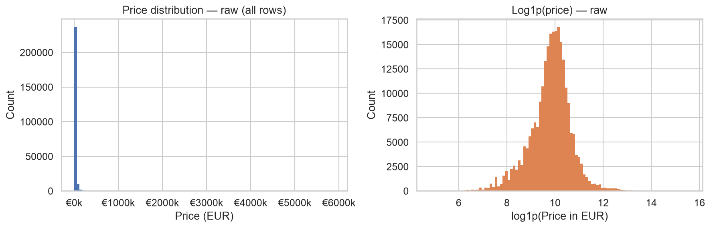

---

## Data Cleaning

### Scope decision: general-market used cars

The dataset professor explicitly advised building a **general-market** model, not a
model that attempts to price everything from salvage cars to Ferraris.
Cars at the extremes of the price, age, or mileage spectrum follow different
pricing logic and would degrade model performance for the typical buyer and seller.

### Twelve sequential cleaning rules

All filters were applied **sequentially** — each step operates on the already-filtered
output of the previous step, ensuring accurate row-count accounting.

```{python}
#| label: tbl-cleaning
#| tbl-cap: "Sequential cleaning steps with rows removed at each stage"

steps = clean_meta["cleaning_steps"]
tbl = pd.DataFrame([{
    "Step": i+1,
    "Rule": s["step"],
    "Removed": f"{s['removed']:,}",
    "Remaining": f"{s['remaining']:,}"
} for i, s in enumerate(steps)])
tbl.style.hide(axis="index")
```

### Justification for scope filters

**Year ≥ 2000 (removed 1,924 rows)**
Pre-2000 vehicles are classic or collector cars. A 1975 Porsche 911 is worth
*more* than a 2005 Porsche 911 — age increases value rather than decreasing it.
Including oldtimers would teach the model a non-monotonic age-price relationship
that does not apply to general used cars.

**Price €500–€80,000 (removed 77 + 7,078 = 7,155 rows)**
Listings below €500 are typically scrap-value or parts cars, not general-market
vehicles. Listings above €80,000 — Bentley, Ferrari, Lamborghini, Porsche 911 GT3 —
are priced on brand prestige, rarity, and collector demand, not the same depreciation
curves that govern everyday cars. The €80,000 cutoff still includes the full premium
mainstream market: BMW 5 Series, Mercedes E-Class, Audi A6, Volvo XC90.

**Mileage = 0 (removed 194 rows)**
Zero-mileage listings on AutoScout24 are dealer-new cars. New-car pricing is driven
by manufacturer MSRP and dealer margin — entirely different from used-car depreciation.
Including them would bias the model's understanding of low-mileage pricing.

**Power 40–800 PS (removed 64 rows)**
Values outside this range are data entry errors or exotic supercars outside scope.

### Dropped columns

| Column | Reason |
|---|---|
| `color` | Low predictive signal; adds ~13 sparse dummy columns |
| `power_kw` | Redundant with `power_ps` (different unit, same information) |
| `registration_date` | Year is sufficient; exact date adds noise |
| `fuel_consumption_l_100km` | Many missing values; correlated with fuel_type and power_ps |
| `fuel_consumption_g_km` | Same as above |
| `offer_description` | Free text, 191,824 unique values — not usable for structured ML |
| `Unnamed: 0` | Auto-generated index column from the original CSV |

### Cleaned data summary

```{python}
#| label: tbl-clean-summary
#| tbl-cap: "Descriptive statistics of the cleaned dataset"

df = pd.read_csv(ROOT / "data/processed/cars_clean.csv")
summary = df[["price_in_euro","power_ps","mileage_in_km","year"]].describe().round(1)
summary.index = ["Count","Mean","Std","Min","25%","Median","75%","Max"]
summary.columns = ["Price (€)","Power (PS)","Mileage (km)","Year"]
summary.style
```

---

## Exploratory Data Analysis

### Price distribution after cleaning

After applying the general-market scope filter, the price distribution is
substantially more symmetric. Skewness dropped from extreme (raw) to approximately
1.20 post-filter — manageable for tree-based models without log-transformation.

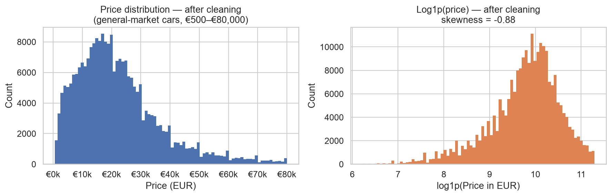

### Year distribution

```{python}
#| label: year-dist
print(f"Median registration year: {int(df['year'].median())}")
print(f"75% of cars registered after: {int(df['year'].quantile(0.25))}")
```

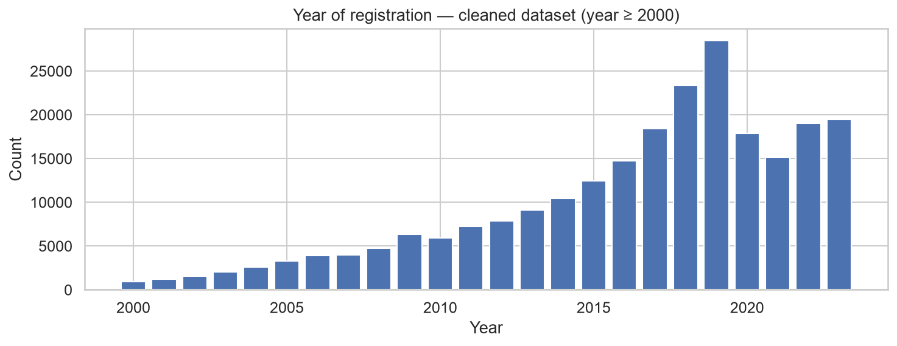

The dataset is concentrated in 2015–2022, reflecting the typical used-car
market inventory on AutoScout24 in 2023.

### Mileage distribution

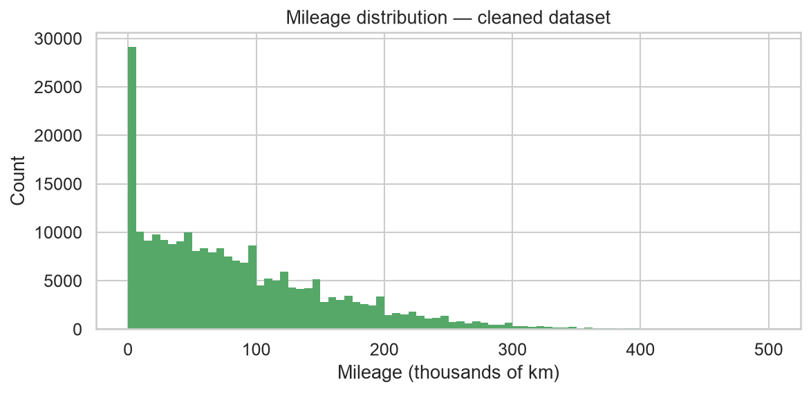

### Horsepower distribution

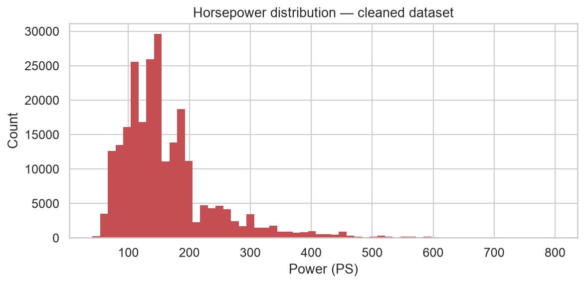

### Price vs mileage

A clear negative relationship is visible — higher mileage correlates with lower price.
This confirms mileage as a strong predictor for both ML tasks.

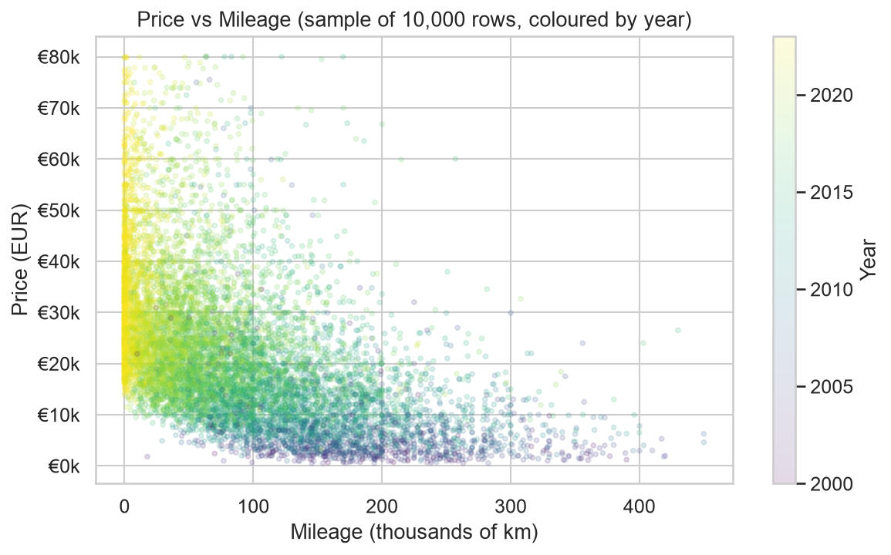

### Brand composition

Volkswagen is the most common brand (32,386 listings), followed by Mercedes-Benz,
Audi, Opel, and BMW.

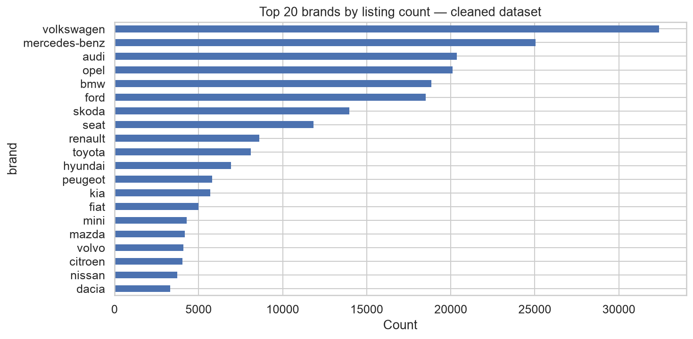

### Fuel type distribution

```{python}
#| label: tbl-fuel
#| tbl-cap: "Fuel type distribution in cleaned dataset"
fuel = df["fuel_type"].value_counts().reset_index()
fuel.columns = ["Fuel type","Count"]
fuel["Share (%)"] = (fuel["Count"] / len(df) * 100).round(1)
fuel.style.hide(axis="index")
```

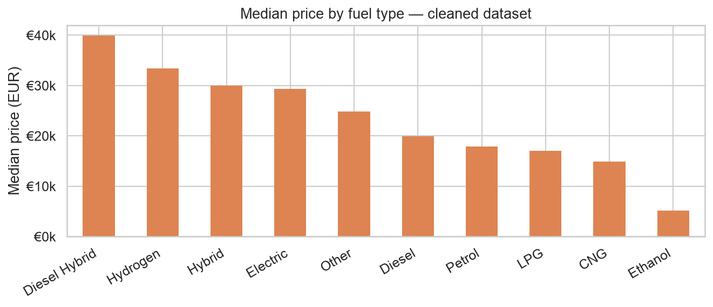

### Correlation structure

The correlation heatmap uses only genuinely numeric columns.
Categorical variables such as `brand` and `model` were not label-encoded
for correlation analysis — assigning arbitrary integers (e.g. Audi=1, BMW=2)
implies a meaningless ordering and produces misleading correlation values.

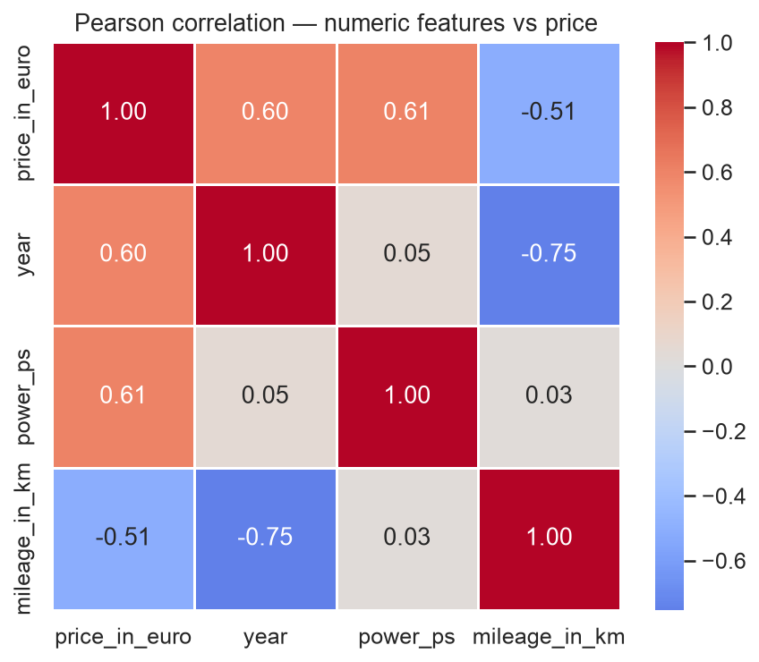

Notable relationships:

- `power_ps` and `price_in_euro`: strong positive correlation (r ≈ 0.59)
- `car_age` and `price_in_euro`: moderate negative correlation
- `mileage_in_km` and `car_age`: moderate positive correlation (older cars have more km)

---

## Feature Engineering

### From 8 raw columns to 8 model features

The cleaned dataset contains: `brand`, `model`, `year`, `price_in_euro`,
`power_ps`, `transmission_type`, `fuel_type`, `mileage_in_km`.

Two new features were engineered and `year` was dropped:

**`car_age = 2023 − year`**

Car *age* drives depreciation, not the calendar year. A 10-year-old car costs
less than a 2-year-old car — this relationship holds regardless of what year it
currently is. Using age instead of raw year also makes the linear term in
Ridge/Logistic Regression interpretable.
Keeping both `year` and `car_age` would introduce perfect collinearity
(`car_age = 2023 − year`), which destabilises Ridge regression and reduces
interpretability. `year` was therefore dropped entirely after engineering `car_age`.

**`mileage_per_year = mileage_in_km / max(car_age, 1)`**

Raw mileage and car age are correlated — older cars naturally have more kilometres.
`mileage_per_year` captures *usage intensity*: a car with 200,000 km over 20 years
is normal; the same mileage over 5 years signals heavy use and commands a lower price.
`max(car_age, 1)` prevents division by zero for 2023 listings where `car_age = 0`.

### Final feature columns

```{python}
#| label: tbl-features
#| tbl-cap: "Eight feature columns passed to the pipeline"

feature_info = pd.DataFrame([
    {"Feature": "brand",             "Type": "Categorical", "Encoding": "OneHotEncoder"},
    {"Feature": "model",             "Type": "Categorical", "Encoding": "OneHotEncoder (min_freq=50)"},
    {"Feature": "fuel_type",         "Type": "Categorical", "Encoding": "OneHotEncoder"},
    {"Feature": "transmission_type", "Type": "Categorical", "Encoding": "OneHotEncoder"},
    {"Feature": "car_age",           "Type": "Numeric (engineered)", "Encoding": "StandardScaler"},
    {"Feature": "power_ps",          "Type": "Numeric",     "Encoding": "StandardScaler"},
    {"Feature": "mileage_in_km",     "Type": "Numeric",     "Encoding": "StandardScaler"},
    {"Feature": "mileage_per_year",  "Type": "Numeric (engineered)", "Encoding": "StandardScaler"},
])
feature_info.style.hide(axis="index")
```

---

## Target Creation and Train/Test Split

### Classification target: `price_segment`

The `price_segment` column (HIGH / LOW) was derived from `price_in_euro` using a
threshold computed from the **training set only**:

$$\text{threshold} = \text{median}(y_{\text{reg\_train}}) = €`{python} f"{threshold:,.0f}"`$$

Computing the threshold from the full dataset would constitute data leakage —
the test set prices would influence the label applied to those same rows.
The threshold is saved in `models/price_segment_threshold.json` and the
derivation is documented.

The resulting class distribution is nearly perfectly balanced:

```{python}
#| label: class-balance
bal = split_meta["class_balance_train"]
print(f"Training set — LOW: {bal['LOW_0']*100:.2f}%  HIGH: {bal['HIGH_1']*100:.2f}%")
bal_t = split_meta["class_balance_test"]
print(f"Test set     — LOW: {bal_t['LOW_0']*100:.2f}%  HIGH: {bal_t['HIGH_1']*100:.2f}%")
```

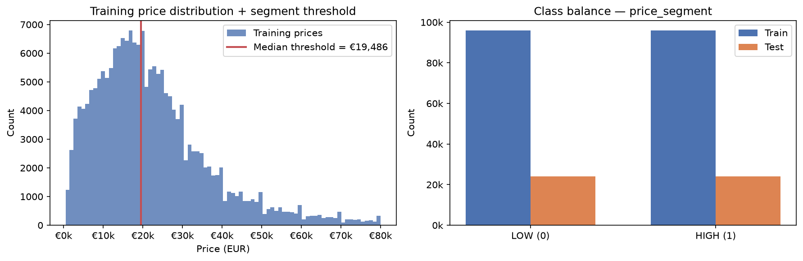

### Train/test split

- **Strategy:** 80/20 random split, stratified by `price_segment`
- **Random state:** 42 (reproducible)
- **Training set:** 192,013 rows
- **Test set:** 48,004 rows (held out entirely until final evaluation)

Stratification ensures both splits maintain the same ≈50/50 HIGH/LOW ratio,
preventing any accidental class imbalance between training and test sets.

---

## Pipeline Architecture and Leakage Prevention

### Why leakage prevention matters

Data leakage occurs when information from the test set (or from the target variable)
influences model training. Leakage inflates apparent performance during development
but causes the model to fail when deployed on genuinely unseen data.

### Specific leakage risks and how they were closed

| Risk | Prevention |
|---|---|
| `price_in_euro` used as classification feature | Excluded entirely from `FEATURE_COLS` |
| Segment threshold computed from full dataset | Computed from `y_reg_train` median only |
| Encoder/scaler fitted on full dataset | Fitted inside `Pipeline.fit(X_train)` only |
| Test data seen during preprocessing | `Pipeline.predict(X_test)` transforms only, never fits |

### Pipeline structure

```
ColumnTransformer
├── OneHotEncoder(handle_unknown="ignore")
│   └── brand, fuel_type, transmission_type
├── OneHotEncoder(min_frequency=50, handle_unknown="infrequent_if_exist")
│   └── model  [1,191 unique values → 496 columns + 1 infrequent bucket]
└── StandardScaler()
    └── car_age, power_ps, mileage_in_km, mileage_per_year
↓
VarianceThreshold(threshold=0.0)     ← feature selection step
↓
XGBoostClassifier / XGBoostRegressor
```

After encoding, the pipeline works with **559 features**:
46 brand dummies + 496 model dummies + 13 fuel/transmission dummies + 4 scaled numerics.

### Feature selection: VarianceThreshold

`VarianceThreshold(threshold=0.0)` removes any feature with zero variance —
columns that carry the same value for every training row and therefore provide
no discriminating information. It is fitted on `X_train` only (leakage-safe),
making it an auditable, documented feature-selection step inside the pipeline.

**Result:** 0 features removed. This confirms that `OneHotEncoder(min_frequency=50)`
already eliminated all near-constant columns — no brand or model category had
zero variance in the training data.

### Leakage proof

The `StandardScaler` embedded in the saved pipeline stores the mean it was fitted on.
This mean matches `X_train.mean()` to four decimal places and differs from the
full-dataset mean — proving the preprocessor saw only training data.

### High-cardinality model column

The `model` column contains 1,191 unique values.
`OneHotEncoder(min_frequency=50)` collapses models with fewer than 50 training
examples into a shared infrequent bucket. This prevents sparse, near-useless
dummy columns for rare listings while preserving signal for common models.

The `brand` column is retained alongside `model` because rare models collapse
into the same infrequent bucket regardless of manufacturer — without `brand`,
a rare Porsche and a rare Opel would be indistinguishable in feature space,
despite a median price difference of tens of thousands of euros.

---

## Model Ladder — Classification

Four models were trained in order of increasing complexity. Each is evaluated on
the held-out test set only; training metrics are reported separately to assess overfitting.

### Metric choice: F1_macro

F1_macro is the primary classification metric.
The DummyClassifier always predicts HIGH and achieves F1_binary = 0.667 —
this looks deceptively reasonable but reflects perfect recall on one class
and zero recall on the other.
F1_macro = (F1_HIGH + F1_LOW) / 2 = (0.667 + 0.000) / 2 = **0.333**,
which honestly represents a model that performs barely above chance.
All real models are compared against this honest baseline.

### Results

```{python}
#| label: tbl-cls
#| tbl-cap: "Classification leaderboard — test-set metrics"

display = cls_lb[["Model","Accuracy","F1_binary","F1_macro","ROC-AUC","Train_Acc","Train_F1_macro"]].copy()
display.columns = ["Model","Accuracy","F1 (binary)","F1 (macro)","ROC-AUC","Train Acc","Train F1 (macro)"]
display.style.hide(axis="index").format({
    "Accuracy": "{:.4f}", "F1 (binary)": "{:.4f}", "F1 (macro)": "{:.4f}",
    "ROC-AUC": "{:.4f}", "Train Acc": "{:.4f}", "Train F1 (macro)": "{:.4f}"
})
```

### Model-by-model discussion

**DummyClassifier (most_frequent)**
The baseline always predicts HIGH. Accuracy = 0.500, F1_macro = 0.333, AUC = 0.500.
This is the floor — any real model must substantially exceed this to justify its complexity.

**Logistic Regression (C=10)**
A linear model in 559-dimensional feature space. F1_macro = 0.929, AUC = 0.978.
The near-zero train-test gap (0.933 → 0.929) indicates no overfitting and reveals
that price segment is nearly linearly separable from these features. The additive
structure of brand + age + mileage + power is sufficient for a linear boundary.
C=10 was selected via GridSearchCV (values [0.01, 0.1, 1, 10], cv=3) in a
prior validated run and applied directly for reproducibility.

**Decision Tree (max_depth=15)**
F1_macro = 0.919, AUC = 0.945. The train-test gap is wider (0.949 → 0.919,
gap = 0.030), indicating moderate overfitting consistent with an unpruned deep tree.
Performance is slightly below Logistic Regression, suggesting that single-tree
non-linearity does not help here. Depth=15 was selected via GridSearchCV
(values [5, 10, 15, None], cv=3).

**XGBoost (tuned)**
F1_macro = 0.934, AUC = 0.982. Best test performance with a small train-test gap
(0.946 → 0.934, gap = 0.012), demonstrating effective regularisation.
The 0.005 F1_macro advantage over Logistic Regression captures non-linear
interaction effects (e.g. brand × age × mileage) that the linear model cannot.
Hyperparameters tuned via RandomizedSearchCV (n_iter=6, cv=3, `tree_method="hist"`).

### Evaluation plots

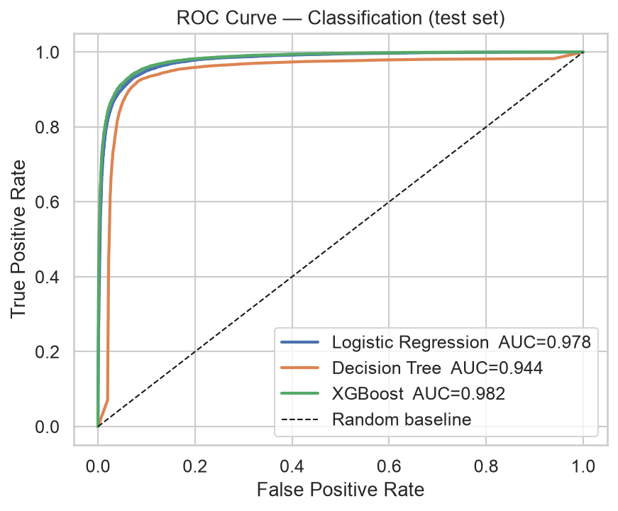

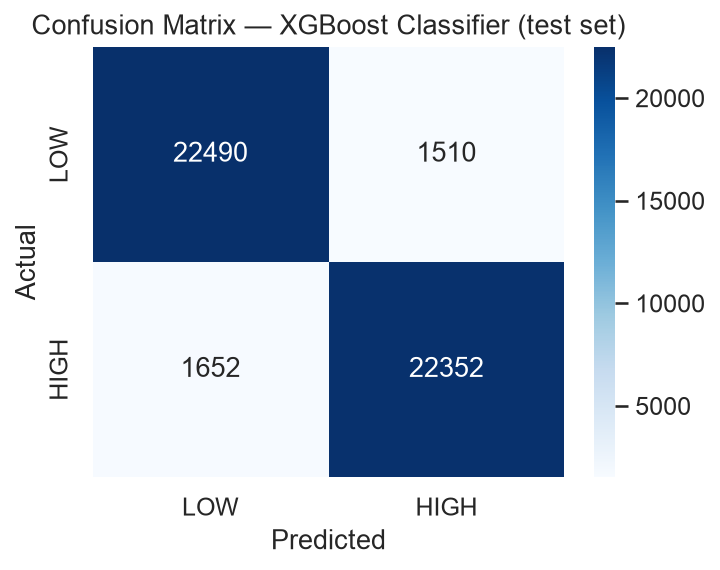

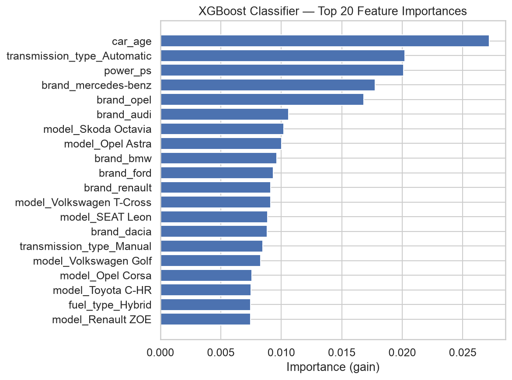

---

## Model Ladder — Regression

### Results

```{python}
#| label: tbl-reg
#| tbl-cap: "Regression leaderboard — test-set metrics"

display_r = reg_lb[["Model","R2","MAE","RMSE","Train_R2","Train_RMSE"]].copy()
display_r.columns = ["Model","R²","MAE (€)","RMSE (€)","Train R²","Train RMSE (€)"]
display_r.style.hide(axis="index").format({
    "R²": "{:.4f}", "MAE (€)": "{:,.0f}", "RMSE (€)": "{:,.0f}",
    "Train R²": "{:.4f}", "Train RMSE (€)": "{:,.0f}"
})
```

### Model-by-model discussion

**DummyRegressor (mean)**
Predicts the training-set mean price (≈€22,000) for every car.
R² = 0.000, RMSE = €14,369. This is the baseline — any model must beat this
to justify its existence.

**Ridge Regression (alpha=0.1)**
R² = 0.841, RMSE = €5,726. The most noteworthy result in the regression ladder.
A simple linear model explains 84.1% of price variance, and the train-test gap
is essentially zero (Train R² = 0.841, Test R² = 0.841) — no overfitting whatsoever.
This demonstrates that used-car pricing has a strong additive structure well-captured
by a linear combination: brand effect + age effect + mileage effect + power effect.
alpha=0.1 was selected via RidgeCV (values [0.1, 1, 10, 100, 1000]).

**Decision Tree Regressor (max_depth=15)**
R² = 0.856, RMSE = €5,452. Slightly better than Ridge on the test set, but with
a meaningful train-test gap (Train R² = 0.911 → Test R² = 0.856, gap = 0.055),
indicating overfitting consistent with a deep single tree.

**XGBoost (tuned)**
R² = 0.905, RMSE = €4,430, MAE = €2,602. Best test performance.
The train-test gap is small (0.922 → 0.905, gap = 0.017), reflecting effective
regularisation. XGBoost captures non-linear interaction effects beyond Ridge's
additive structure — most importantly, the interaction between brand, age, and
mileage that determines price for specific model variants.

### Evaluation plots

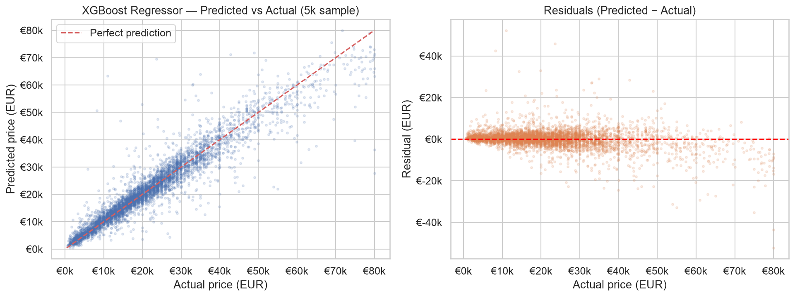

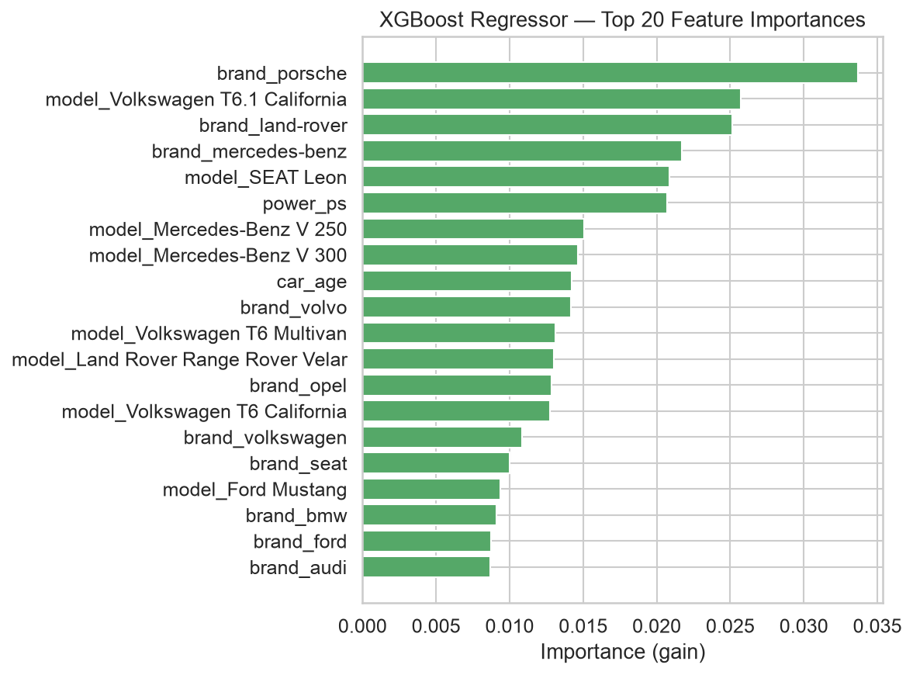

---

## Results Summary and Interpretation

### Best models selected for deployment

| Task | Model | Key metric |
|---|---|---|
| Classification | XGBoost (tuned) | F1_macro 0.934 · AUC 0.982 |
| Regression | XGBoost (tuned) | R² 0.905 · RMSE €4,430 · MAE €2,602 |

Both complete sklearn Pipelines (preprocessor → VarianceThreshold → XGBoost)
are serialised to `.pkl` files and loaded by the Streamlit app at inference time.

### Overfitting and underfitting analysis

```{python}
#| label: tbl-gaps
#| tbl-cap: "Train-test performance gaps across all models"

gaps = pd.DataFrame([
    {"Task": "Classification", "Model": "Dummy",              "Train F1_macro": 0.3333, "Test F1_macro": 0.3334, "Gap": 0.0001},
    {"Task": "Classification", "Model": "Logistic Regression","Train F1_macro": 0.9328, "Test F1_macro": 0.9291, "Gap": 0.0037},
    {"Task": "Classification", "Model": "Decision Tree",      "Train F1_macro": 0.9489, "Test F1_macro": 0.9189, "Gap": 0.0300},
    {"Task": "Classification", "Model": "XGBoost",            "Train F1_macro": 0.9461, "Test F1_macro": 0.9341, "Gap": 0.0120},
    {"Task": "Regression",     "Model": "Dummy",              "Train R²": 0.0000, "Test R²": 0.0000, "Gap": 0.0000},
    {"Task": "Regression",     "Model": "Ridge",              "Train R²": 0.8412, "Test R²": 0.8412, "Gap": 0.0000},
    {"Task": "Regression",     "Model": "Decision Tree",      "Train R²": 0.9112, "Test R²": 0.8560, "Gap": 0.0552},
    {"Task": "Regression",     "Model": "XGBoost",            "Train R²": 0.9223, "Test R²": 0.9049, "Gap": 0.0174},
])
gaps.style.hide(axis="index")
```

Key observations:

- **Logistic Regression and Ridge** both show near-zero train-test gaps, confirming
  no overfitting and strong generalisation of the linear structure in this dataset.
- **Decision Trees** show the largest gaps in both tasks (0.030 classification,
  0.055 regression), consistent with the tendency of deep trees to memorise
  training noise.
- **XGBoost** achieves the best test performance with modest, well-controlled gaps,
  demonstrating effective regularisation via subsampling, column sampling, and
  learning rate shrinkage.

### What the results reveal about used-car pricing

The close performance of Logistic Regression (F1_macro 0.929) to XGBoost (0.934)
in classification, and Ridge (R² 0.841) to XGBoost (0.905) in regression, reveals
a fundamental property of used-car pricing: **the dominant structure is additive**.
A car's price is largely determined by the sum of independent effects:
which brand it is, how old it is, how many kilometres it has, and how powerful it is.
XGBoost's advantage comes from capturing interaction effects — for example,
mileage matters more for cheaper cars than expensive ones, and age penalty differs
by brand — but these interactions account for only a small portion of total variation.

For the regression task: XGBoost's mean absolute error of **€2,602** means that
for the typical car in the dataset, the model's price estimate is within about
€2,600 of the actual AutoScout24 listing price, using only seven input fields.

---

## Limitations

**What this model is designed for:**
General-market used cars listed in Germany in 2023, with year ≥ 2000,
price €500–€80,000, power 40–800 PS, and mileage ≤ 500,000 km.

**What it should not be used for:**

- **Pre-2000 vehicles and oldtimers** — collector pricing logic is inverted (age increases value)
- **New and dealer-demo cars** — MSRP and dealer margin, not depreciation
- **Ultra-luxury and exotic cars** — above €80,000 threshold, different dynamics
- **Non-German markets** — depreciation curves, taxation, and consumer preferences differ
- **Future price prediction** — the model reflects 2023 market conditions; prices have
  shifted since with energy costs, interest rates, and new model releases

**Listed price vs sale price:**
AutoScout24 shows asking prices. Real transactions typically settle 5–15% below asking.
This model predicts asking price, not the final negotiated sale price.

**Feature scope:**
The model uses seven user inputs. Real pricing also depends on exact trim level,
accident history, number of owners, service history, colour, and optional equipment —
none of which are available in this dataset.

---

## Reproducibility

All scripts are deterministic with `random_state=42`:

| Script | Purpose | Output |
|---|---|---|
| `src/clean.py` | Load raw CSV, apply 12 filters, save EDA figures | `data/processed/cars_clean.csv` |
| `src/features.py` | Engineer features, split 80/20, save preprocessor | `data/processed/X_train.csv` etc. |
| `src/train.py` | Train 4-model ladder for each task, save pipelines | `models/*.pkl`, leaderboards |
| `app/app.py` | Streamlit inference app (no training) | Live predictions |

To reproduce from scratch, download the raw dataset from Kaggle
(`wspirat/germany-used-cars-dataset-2023`), place it at `data/raw/germany_cars.csv`,
and run the three scripts in order.
The trained `.pkl` files are committed to the repository and can be used directly
without re-running `src/train.py`.

---

## Conclusion

This project demonstrates a complete, leakage-safe machine learning workflow:
from raw data audit and sequential cleaning, through engineered features and
stratified splitting, to a full model ladder with honest test-set evaluation,
and finally a deployed Streamlit application.

The final XGBoost models achieve **F1_macro 0.934** for price segment classification
and **R² 0.905 / MAE €2,602** for price regression, substantially exceeding their
respective dummy baselines (F1_macro 0.333 and RMSE €14,369).
The near-zero train-test gap of Ridge Regression reveals a strong additive pricing
structure, while XGBoost's modest but consistent advantage confirms the presence
of meaningful non-linear interaction effects.

The live application is accessible at:
**[https://germany-used-cars-ml.streamlit.app/](https://germany-used-cars-ml.streamlit.app/)**
